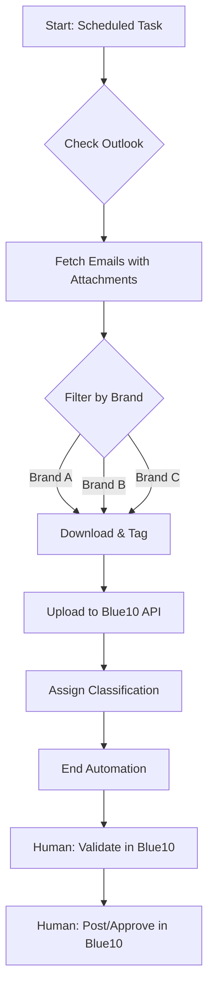

# Accounting Workflow Automation MVP

## Overview
This project is an MVP/demo for automating data entry and accounting workflows across software platforms like **Exact**, **Blue10**, and **Excel**. It is designed to use agentic workflows that ingest screen recordings and execute replicated tasks using specialized subagents.

## Goals
1. **Screen Recording Ingestion**: Process video/screen workflows to understand the exact steps taken by human operators.
2. **Subagent Orchestration**: Spin up dedicated subagents to replicate data extraction, transformation, and entry.
3. **Multi-Platform Support**: Seamlessly operate across Exact, Blue10, and Excel.
4. **Email-to-Blue10 Pipeline (OCR)**: Automatically ingest manual invoice PDFs from emails, extract text/data via OCR, and translate/process them accurately.
5. **Knowledge Base Integration**: Adhere strictly to a defined set of accounting rules and exceptions acting as a knowledge repository for the subagents.
6. **Verification Steps**: Built-in verification mechanisms to validate data integrity and rule compliance before and after entry.
7. **Data Security & Privacy**: Ensure strict handling of sensitive financial/client data in practice (data anonymization, secure credential stores, localized processing where necessary).

## Project Structure
- `agents/`: Contains the logic for the subagents and orchestration.
- `data/`: Local directory for processing temporary files, Excel sheets, and screen recordings (Ensure this is Git-ignored for security).
- `docs/`: Additional documentation on architecture, data security policies, and software integration specifics.
- `scripts/`: Utility scripts for running the MVP.

## Next Steps
- Define the exact inputs (e.g., MP4 screen recordings, Excel template).
- Setup the agent environment (e.g., using Playwright/Browser-use for web apps like Exact/Blue10, and pandas/openpyxl for Excel).
- Configure OCR models and pipelines for PDF invoice data extraction.
- Draft the initial Knowledge Base outlining the specific accounting rules and exceptions.

## Outlook-to-Blue10 Workflow (Draft)

### Overview
Automates the ingestion of invoices from Outlook emails into Blue10 for three distinct brands.

### Implementation Blueprint
- **Connectors**: Microsoft Graph API (Outlook) and Blue10 API.
- **Brand Classification**: Routing based on email metadata.
- **Automation Flow**: Fetch -> Download -> Upload -> Classify.

### Flowchart

